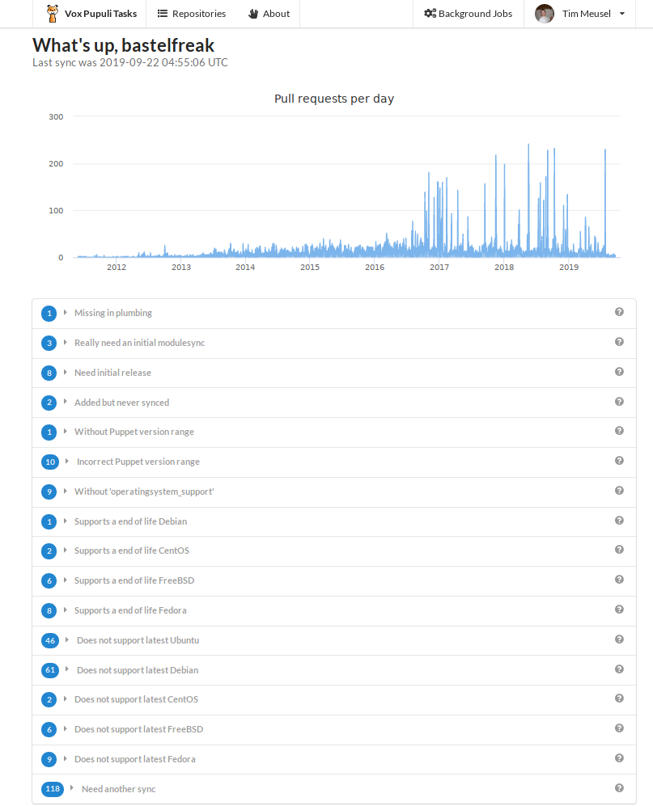
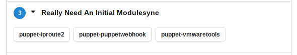
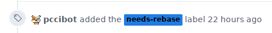
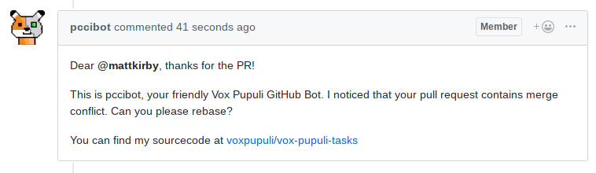
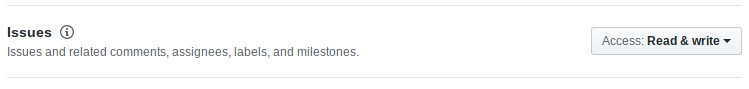
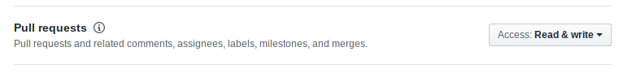
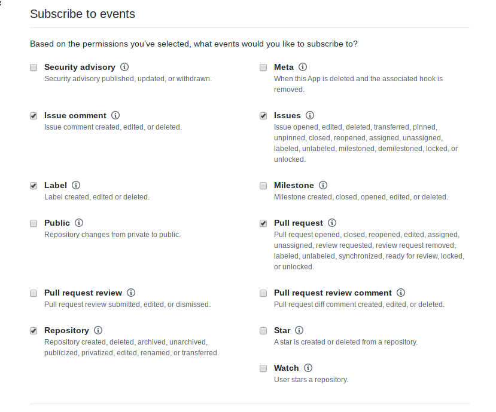

# Vox Pupuli Tasks - The Webapp for community management

[](https://travis-ci.org/voxpupuli/vox-pupuli-tasks)
[](LICENSE)
[](https://microbadger.com/images/voxpupuli/vox-pupuli-tasks)
[](https://microbadger.com/images/voxpupuli/vox-pupuli-tasks)
[](https://GitHub.com/voxpupuli/vox-pupuli-tasks/releases/)
[](https://hub.docker.com/r/voxpupuli/vox-pupuli-tasks)
[](https://hub.docker.com/r/voxpupuli/vox-pupuli-tasks)
[](https://www.codacy.com/app/VoxPupuli/vox-pupuli-tasks)

## Table of contents

* [Purpose](#purpose)
  * [Reviewing open Pull Requests](#reviewing-open-pull-requests)
  * [Yak shaving Puppet modules](#yak-shaving-puppet-modules)
* [Usage](#usage)
* [Existing Automatisation](#existing-automatisation)
  * [Merge Conflicts](#merge-conflicts)
  * [Sync GitHub labels](#sync-github-labels)
* [Local Setup](#local-setup)
* [Production Setup](#production-setup)
  * [Cerebro](#cerebro)
  * [Elasticsearch](#elasticsearch)
  * [Kibana](#kibana)
  * [Sentry](#sentry)
  * [GitHub App Setup](#github-app-setup)
    * [Permissions](#permission)
    * [Events](#events)
* [Contribution and Development](#contribution-and-development)
  * [Add new Operating system checks](#add-new-operating-system-checks)
* [License](#license)
* [Docker Tricks](#docker-tricks)
* [Sponsor](#sponsor)

## Purpose

As a collaborator at [Vox Pupuli](https://voxpupuli.org) we have basically two
different kinds of main tasks:

* Reviewing open Pull Requests
* Yak shaving [Puppet modules](https://forge.puppet.com/puppet)

We currently have a few tools for those jobs:

## Reviewing open Pull Requests

* [https://octobox.io/](https://octobox.io/) is a nice external webinterface to work with github issues and pull requests
* [https://voxpupuli-open-prs.herokuapp.com/](https://voxpupuli-open-prs.herokuapp.com/) is [our own](https://github.com/voxpupuli/open-prs#vox-pupuli-open-prs) Sinatra app to display all pull requests
* GitHub has a nice search function for [pull requests](https://github.com/pulls?q=is%3Aopen+is%3Apr+user%3Avoxpupuli+archived%3Afalse+sort%3Acreated-asc) but also [for issues](https://github.com/issues?q=is%3Aopen+is%3Aissue+user%3Avoxpupuli+archived%3Afalse+sort%3Acreated-asc)
* The [community_management](https://github.com/underscorgan/community_management#community-management) project provides some CLI tools to generate different reports about open pull requests

Collaborators review a lot of code in many pull requests. But there are even
more pull requests that are open but don't need any attention. A collaborator
spends a lot of time to figure out which pull request actually needs attention.

One of the goals of this project is to provide a proper UI that displays
filtered pull requests. Some examples:

It's not required to review code in a pull request if a merge conflict exists.
If the PR is properly labeled, we can exclude it from the UI. The service gets
notifications from GitHub for each activity on a PR. If a conflict appears, a
label will be added. It will also automatically be removed if the conflict
disappears after a rebase.

Instead of dealing with all open PRs over and over, collaborators can spend
their time to reviewing pull requests that actually need it.

Some more examples are documented as [open issues](https://github.com/voxpupuli/vox-pupuli-tasks/issues/), in particular [issue 4](https://github.com/voxpupuli/vox-pupuli-tasks/issues/4)

## Yak shaving Puppet modules

* The [get_all_the_diffs](https://github.com/voxpupuli/modulesync_config/blob/master/bin/get_all_the_diffs) script, which detects inconsistencies in modules

This is the second big tasks for collaborators. Update dependencies in
metadata.json files, allow new Puppet versions, drop legacy Operating Systems.
There are many many tasks that collaborators do from time to time and this
project tries to make it as easy as possible or even automate stuff where it's
suitable.

## Usage

You can currently access a beta version at [voxpupu.li](https://voxpupu.li).
This is a MVP that we redeploy with enhancements every few days at the moment.
The app uses GitHubs OAuth for authentication:

[](https://voxpupu.li)

The application is developed by
[Robert 'flipez' Müller](https://github.com/flipez) and
[Tim 'bastelfreak' Meusel](https://github.com/bastelfreak). The current OAuth
app is registed to their personal account but will soon be migrated to the Vox
Pupuli GitHub organisation. You do not need to grant the application access to
any repository. This OAuth setup is only used to authenticate the user.

In the future it's possible to restrict the login or certain features to people
that are members of specific GitHub organisations or teams. We didn't want to
reimplement a whole usermanagement so we rely on GitHub OAuth.

After the login, you see the following page:

[](https://voxpupu.li)

Each yak shaving task is a row. It's prefixed with the number of modules that
are in this category. For example:

[](https://voxpupu.li)

You can click on each PR. The app displays all the information that GitHub
provides. It will also list open pull requests. It will be possible to filter
this. The filtering will also work for all open pull requests in a namespace.
The design and scope is currently discussed and implemented in
[Issue #4](https://github.com/voxpupuli/vox-pupuli-tasks/issues/4).

Besides being an OAuth application, this Ruby on Rails website is also a
registered GitHub Application. This means that GitHub sends notifications
for user interactions to the Rails app. The app gets information about every
new pull request, new label, new code or comments in a pull request and much
more. We currently store those notifications in a self hosted
[Sentry](#sentry). The displayed data in the frontend comes from polling the
GitHub API and from analysing the notifications. In the future we all add more
automisation to the app, which will be based on the notifications. Use cases for
automisation are discussed and developed at:

* [Issue #1](https://github.com/voxpupuli/vox-pupuli-tasks/issues/1) - handle merge conflicts
* [Issue #2](https://github.com/voxpupuli/vox-pupuli-tasks/issues/2) - handle CI failures

Other [open issues](https://github.com/voxpupuli/vox-pupuli-tasks/issues) might
also be good candidates for live interactions based on notifications. Please
comment the open issues or raise new ones if you have crazy ideas.

## Existing Automatisation

We aim to automate different use cases. Each usecase gets a dedicated milestone
at [GitHub](https://github.com/voxpupuli/vox-pupuli-tasks/milestones) to track
the issues and pull requests.

### Merge Conflicts - [Milestone 1](https://github.com/voxpupuli/vox-pupuli-tasks/milestone/1)

At the moment, the application handles appearing and disappearing merge
conflicts. Since
[PR #35](https://github.com/voxpupuli/vox-pupuli-tasks/pull/35) went live, we
are able to detect if a Pull request went from a mergeable into a non-mergeable
state. In this case we check if the label `merge-conflicts` is present in the
repository. Afterwards we add it to the pull request.

[](https://voxpupu.li)

Also our bot Account adds a comment to the pull request. GitHub does not send
notifications to the author whe a label was added, but for comments.

[](https://voxpupu.li)

### Sync GitHub Labels

People heavily depend on labels for their daily collaborator work. To ensure
that they can use the correct labels, this App tracks an authoritative list
of:

* Label names
* Their colour
* Their description

The application ensures that all those labels are configured in all
repositories.

This is all managed in [one yaml file](https://github.com/voxpupuli/vox-pupuli-tasks/blob/67d27076e025de2d8336d535da91eac8bb5d667f/config/voxpupuli.yml#L41).

Update the file to automatically update all labels in a repository. This app
does not remove labels that aren't in the yaml. It just ensures that all labels
from the yaml file are present in the repositories.

Future work: The yaml already supports aliases for labels. The idea is that the
app searches for labels in repositories with an alias. Matching labels could be
renamed to the correct one.

The work for this feature is/was tracked in [issue #131](https://github.com/voxpupuli/vox-pupuli-tasks/issues/131).

## Local Setup

To start the app locally, do the following (assumes that you've ruby, bundler
and yarn available, also redis needs to be started):

```sh
git clone git@github.com:voxpupuli/vox-pupuli-tasks.git
cd vox-pupuli-tasks
bundle install --jobs $(nproc) --with development test --path vendor/bundle
bundle exec yarn install --frozen-lockfile --non-interactive
export SECRET_KEY_BASE=$(bundle exec rails secret)
bundle exec rails assets:precompile
# somehow generate config/master.key
RAILS_ENV=development bundle exec rails db:migrate
bundle exec foreman start
```

Secrets are stored as an encrypted yaml file. You can edit them by doing:

```sh
bundle exec rails credentials:edit
```

This only works properly if one od the developers sent you the `/config/master.key`
file.

[Foreman](https://rubygems.org/gems/foreman) will take care of the actual rails
application, but it will also start [sidekiq](https://github.com/mperham/sidekiq#sidekiq).

## Production Setup

The production setup is a homage to microservices:


The setup is deployed as docker microservices. This repository contains a
[docker-compose.yaml](docker-compose.yaml) for this.

We deploy multiple containers:

* watchtower
* [cerebro](https://github.com/lmenezes/cerebro#cerebro)
* Elasticsearch
* Redis
* Sidekiq
* [Kibana](https://www.elastic.co/products/kibana)
* [Sentry](https://sentry.io/welcome/)
* The actual application

### Cerebro

This is a webinterface for Elasticsearch. The service is available at
localhost:9001. We highly suggest that you deploy an nginx in front of it with
proper TLS certiicates. To access the elasticsearch container, you can use this
URL:

`http://localhost:9001/#/overview?host=http:%2F%2Felasticsearch:9200`

The `docker-compose.yaml` sets `elasticsearch` as FQDN for the container.

### Elasticsearch

We use the [semantic logger](https://rocketjob.github.io/semantic_logger) to
log all rails data to elasticsearch. Logs are important, and writing them to a
file in a container is a bad idea.

### Kibana

Kibana is our frontend for elasticsearch. It's available at localhost on port
5601.

## Sentry

ToDo: Describe how we forward errors to Sentry

## GitHub App Setup

As mentioned in the [usage](#usage) section, this Ruby on Rails application can
be registered as a GitHub App. To do this, a few things need to be configured.

### `User authorization callback URL`

The full URL to redirect to after a user authorizes an installation. For our
instance this is [https://voxpupu.li/auth/github/callback](https://voxpupu.li/auth/github/callback)

### `Request user authorization (OAuth) during installation`

Requests that the installing user grants access to their identity during
installation of the application.

This allows us to validate if a user is in a specific GitHub organisation or
Team.

### `Webhook URL`

Events will POST to this URL. For our instance this is [https://voxpupu.li/incoming/github](https://voxpupu.li/incoming/github)

### Permissions

Sadly, we require `Administration` access with `Read and write`. It will allow
us to add labels to a project.

[](https://voxpupu.li)

We need `Read and write` access to issues because we add/remove labels to pull
requests and also comment on them. More information can be found at
[the GitHub developer docs](https://developer.github.com/v3/apps/permissions/#permission-on-issues).
(For GitHub, a pull request is a specific issue. That's why pull request
permissions ar handled on the issue endpoints).

[](https://voxpupu.li)

The same applies for the Pull requests. More information can be found at
[the GitHub developer docs](https://developer.github.com/v3/apps/permissions/#permission-on-pull-requests)

[](https://voxpupu.li)

### Events

We also need to tell GitHub which events we would like to get:

[](https://voxpupu.li)

API docs for:

* [Issue comment](https://developer.github.com/v3/activity/events/types/#issuecommentevent)
* [Label](https://developer.github.com/v3/activity/events/types/#labelevent)
* [Repository](https://developer.github.com/v3/activity/events/types/#repositoryevent)
* [Pull Request](https://developer.github.com/v3/activity/events/types/#pullrequestevent)
* [Issues](https://developer.github.com/v3/activity/events/types/#issuesevent)

## Contribution and Development

We have a helpful rake task available to run a ruby linter. It will inform you
about styleguide violations. Please execute it before you provide a pull
request:

```sh
bundle exec rake rubocop
```

This will execute the linter. You can also advice him to automatically fix
things (works often, but not on all issues):

```sh
bundle exec rake rubocop::auto_correct
```

We constantly improve our codebase. We adjusted a few rubocop cops to relax
the default configuration. Also sometimes we need to merge important changes
that violate the current rubocop config. For such situations we need to run

```sh
bundle exec rubocop --auto-gen-config
```

### Add new Operating system checks

Among all the stuff we validate is also a check for supported operating systems
in the `metadata.json` file in a Puppet module. Sometimes a new version
[is released](https://lists.centos.org/pipermail/centos-announce/2019-September/023449.html).

We need to update the checks. Currently, we need to adjust two places, the
version array and the messages that are displayed in the UI:

The array:

```diff
diff --git a/config/initializers/voxpupuli.rb b/config/initializers/voxpupuli.rb
index 14b0459..cc4f26e 100644
--- a/config/initializers/voxpupuli.rb
+++ b/config/initializers/voxpupuli.rb
@@ -16,6 +16,6 @@ PUPPET_SUPPORT_RANGE = '>= 5.5.8 < 7.0.0'
 # https://github.com/camptocamp/facterdb/pull/82#event-1600066178
 UBUNTU_SUPPORT_RANGE = ['16.04', '18.04'].freeze
 DEBIAN_SUPPORT_RANGE = [8, 9, 10].freeze
-CENTOS_SUPPORT_RANGE = [6, 7].freeze
+CENTOS_SUPPORT_RANGE = [6, 7, 8].freeze
 FREEBSD_SUPPORT_RANGE = [11, 12].freeze
 FEDORA_SUPPORT_RANGE = [29, 30, 31].freeze
```

and the messages:

```diff
diff --git a/config/locales/en.yml b/config/locales/en.yml
index bbd6c7a..098d987 100644
--- a/config/locales/en.yml
+++ b/config/locales/en.yml
@@ -56,13 +56,13 @@ en:
       description: We support Debian 8, 9 and 10. Modules in here don't support Debian 10.
     supports_eol_centos:
       title: Supports a end of life CentOS
-      description: We support CentOS 6 and 7. Modules in here support a end of life version (< CentOS 6)
+      description: We support CentOS 6, 7 and 8. Modules in here support a end of life version (< CentOS 6)
     doesnt_support_latest_centos:
       title: Does not support latest CentOS
-      description: We support CentOS 6 and 7. Modules in here don't support CentOS 7.
+      description: We support CentOS 6, 7 and 8. Modules in here don't support CentOS 8.
     missing_in_plumbing:
       title: Missing in plumbing
       description: Is missing in plumbing
     need_another_sync:
       title: Need another sync
```

## License

This project is licensed under [GNU Affero General Public License version 3](LICENSE)

## Docker tricks

Start just the rails console while all containers are off:

```sh
docker-compose run --no-deps web bundle exec rails console
```

Start all containers:

```sh
docker-compose up -d
```

Start the rails console while containers are running:

```sh
docker-compose exec web bundle exec rails c
```

## Sponsor

This project is sponsored by [Hetzner Cloud](https://hetzner.com/cloud). They
provide us with free cloud instances to host the application.

[](https://hetzner.com/cloud)

Are you interested as well in sponsoring parts of the Vox Pupuli organisation?
Get in touch with the [Project Management Committee](mailto:pmc@voxpupuli.org).
